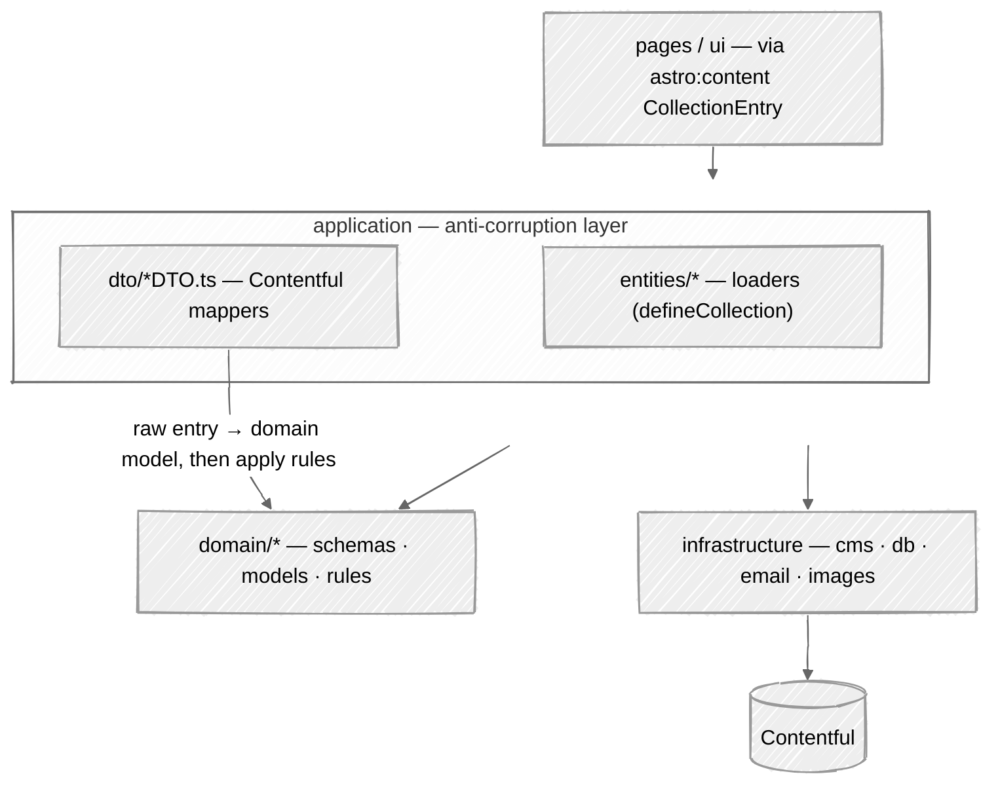

# 12. Pragmatic DDD: a domain layer of models + rules behind a Contentful anti-corruption layer

Date: 2026-07-26

## Status

Accepted.

## Context

Content comes from Contentful ([ADR 0002](./0002-contentful-headless-cms.md)), whose entry shape — `sys`, `fields`, `Entry<Skeleton>` — is not the shape the site reasons about. Left unchecked it spreads: reading time, table of contents and favourite-first ordering end up computed inside mappers, next to `entry.fields.body`, and the editorial rules become impossible to read or test without a CMS payload.

The opposite failure is as real. A textbook domain layer — aggregates, repositories, framework-free types — duplicates every schema Astro already types through `CollectionEntry`, and churns twice on every content change.

## Decision

`src/domain/` owns the domain **models** (Zod `schema.ts` + inferred `types.ts` + vocab enums such as `ArticleType`/`TagType`) and the pure **rules** (`rules.ts`: reading time, table of contents, description/variant derivation, favourite-first sort, city period, ...), one folder per concept (`article`, `author`, `city`, `project`, `tag`, `testimonial`, `contact`, `breadcrumb`, `shared`), each carrying only the files it needs (e.g. `breadcrumb` carries rules and types but no schema, `contact` a schema and the one rule that decides when two addresses are the same person, and concepts whose rules stay in the ACL have no `rules.ts` at all). The Contentful mappers (`application/dto/*/*DTO.ts`) and Astro loaders (`application/entities/*`) stay as an **anti-corruption layer (ACL)** that turns raw Contentful entries into domain models and then calls domain rules.

It is deliberately pragmatic ("-ish"): there are no aggregates, repositories, or domain events, and schemas keep `astro/zod` + `reference()` because Astro drives app-wide typing via `CollectionEntry` (a full framework-free domain was considered and rejected as high-churn duplication for CMS-driven content).

The load-bearing invariant: **`domain/` never imports from `application/` or `infrastructure/`**. It may use `astro/zod`, `astro:content`'s `reference()`, other `@domain/*`, and generic `@shared/utils` helpers only.

## Consequences

- Dependencies point inward only: `ui → application → domain`, with `application → infrastructure → Contentful`. `domain` depends on nothing outward, so the domain model and its rules are testable and CMS-agnostic even though the schemas are Astro-typed.
- Rules that genuinely operate over raw Contentful entries and build cross-collection references (related-by-shared-tags, per-tag/author counts, articles-by-author) stay in the ACL on purpose — decoupling them would not preserve behaviour cheaply.
- A new content type is a four-step path rather than one file: domain concept → DTO → entity loader → collection registration, with the glossary term added to `CONTEXT.md` in the same change.
- Concept names are binding. A folder, field or rule whose name disagrees with `CONTEXT.md` is a bug in one of the two.
