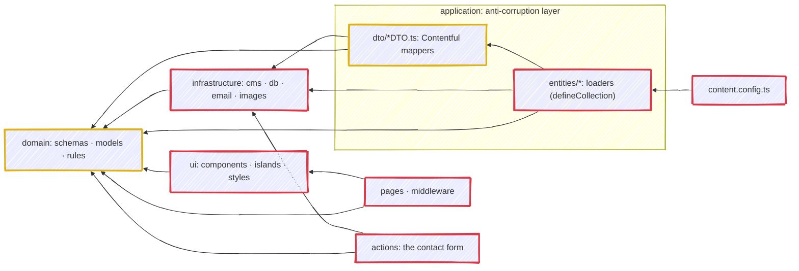

# 12. Pragmatic DDD: a domain layer of models + rules behind a Contentful anti-corruption layer

Date: 2026-07-26

## Status

Accepted.

## Context

Content comes from Contentful ([ADR 0002](./0002-contentful-headless-cms.md)), whose entry shape (`sys`, `fields`, `Entry<Skeleton>`) is not the shape the site reasons about. Left unchecked it spreads: reading time, table of contents and favourite-first ordering end up computed inside mappers, next to `entry.fields.body`, and the editorial rules become impossible to read or test without a CMS payload.

The opposite failure is as real. A textbook domain layer (aggregates, repositories, framework-free types) duplicates every schema Astro already types through `CollectionEntry`, and churns twice on every content change.

## Decision

[`src/domain/`](../../src/domain) owns the domain **models** (Zod `schema.ts` + inferred `types.ts` + vocab enums such as `ArticleType`/`TagType`) and the pure **rules** (`rules.ts`: reading time, table of contents, description/variant derivation, favourite-first sort, city period, ...), one folder per concept (`article`, `author`, `city`, `project`, `tag`, `testimonial`, `contact`, `breadcrumb`, `shared`), each carrying only the files it needs (e.g. `breadcrumb` is rules-only, `contact` is a lone validation schema, and concepts whose rules stay in the ACL have no `rules.ts`). The Contentful mappers (`application/dto/*/*DTO.ts`) and Astro loaders (`application/entities/*`) stay as an **anti-corruption layer (ACL)** that turns raw Contentful entries into domain models and then calls domain rules.

### What the "-ish" means

DDD is a set of practices, not one architecture, and the suffix is a stated split rather than a hedge. The failure mode it names is real: **DDD asks for the abstraction before the code has earned it, and the boilerplate then hides the rules it was meant to protect.**

The split runs along the strategic/tactical line. **The strategic half is not negotiable** and this ADR fixes it: the ubiquitous language of [`CONTEXT.md`](../../CONTEXT.md), the layer boundaries, the dependency direction, the pure domain, and the anti-corruption layer that keeps Contentful out of it. **The tactical half is applied where it pays**, and the test is the three questions of [ADR 0019](./0019-three-questions-before-modelling.md), asked in order: can the illegal state be reached, does anything read it, does it cross a boundary. Three "no" answers mean write the rule down rather than encode it.

Per practice, that lands here. A strategic row is the shape of the tree; a tactical row is a call, and a reviewer who thinks one fell on the wrong side has the three questions to argue with rather than a preference.

| Practice | Half | Here |
| --- | --- | --- |
| **Ubiquitous language** | Strategic | Kept, and binding. [`CONTEXT.md`](../../CONTEXT.md) defines the terms and the code spells them: a folder, field or rule whose name disagrees with the glossary is a bug in one of the two. |
| **Bounded context with an anti-corruption layer** | Strategic | Kept, and it carries the most weight of the three. Contentful's `sys` / `fields` / `Entry<Skeleton>` stops at [`application/`](../../src/application), which is what keeps [ADR 0002](./0002-contentful-headless-cms.md) reversible. |
| **Layers with an inward dependency rule** | Strategic | Kept: every layer points inward at [`domain/`](../../src/domain), and `domain` imports nothing outward. The docs test reads the imports rather than trusting this sentence, which is how the claim that `ui` reaches `application` was caught: it never has. |
| **Entities and value objects** | Tactical | Partly. A concept gets a Zod schema and an inferred type, and identity is stated per concept (one Author is one Slug). A wrapper around a primitive has to earn itself against [ADR 0019](./0019-three-questions-before-modelling.md) first, which is why there is no `Slug` brand. |
| **Aggregates and aggregate roots** | Tactical | Dropped. An aggregate is a consistency boundary for *writes*, and nothing here writes content: Contentful owns that. The one write path in the tree is a contact submission, which is a single row with no invariant spanning it. |
| **Repositories** | Tactical | Dropped as a domain abstraction. [`fetchEntries`](../../src/infrastructure/cms/entries.ts) is the single read seam and Astro's content collections are the read model, so an interface in `domain/` would be a second name for a call that already exists once. |
| **Domain events** | Tactical | Dropped. Nothing in the process reacts to content changing, because a publish is not an event this runtime observes: [`publish-article.yml`](../../.github/workflows/publish-article.yml) takes the Contentful webhook and rebuilds the site. |
| **Framework-free domain types** | Tactical | Dropped deliberately. Schemas keep `astro/zod` and `reference()` because Astro drives app-wide typing through `CollectionEntry`; a parallel framework-free model would be the same shapes written twice and churned on every content change. |

Three of the four dropped rows share one reason worth stating once: aggregates, repositories and domain events all assume an application that owns its own writes, and this one does not. Content is authored in Contentful and read here.

The load-bearing invariant: **`domain/` never imports from `application/` or `infrastructure/`**. It may use `astro/zod`, `astro:content`'s `reference()`, other `@domain/*`, and generic `@shared/utils` helpers only.

Every arrow is an import some file really makes, read off the tree rather than intended; anything not drawn is forbidden. Gold is pure, red owns the side effects. `dto` reaches `infrastructure` and stays gold because what it imports there builds a CDN URL string: the line is I/O, not layering, which is why `dto` sits on the pure side of a layer that also loads.

Two things the arrows deliberately do not show, because neither is an import. **Pages and components never reach the application layer**: [`content.config.ts`](../../src/content.config.ts) is the only module in the tree that imports it, and a route then reads the registered collections through `astro:content`. That indirection is the seam, and it is what lets a page be typed against `CollectionEntry` without knowing a mapper exists. And **Contentful enters at `infrastructure`**, over the network, which is the transport detail everything above it is built to absorb.

## Consequences

- Dependencies point inward only, and the chain is shorter than it looks: `content.config.ts → application → domain`, `application → infrastructure → domain`, and `pages`/`ui` straight to `domain` for the types they render. `domain` depends on nothing outward, so the domain model and its rules are testable and CMS-agnostic even though the schemas are Astro-typed. This ADR said `ui → application → domain` for a year and no file ever did that; a test now asserts the single importer instead.
- Rules that genuinely operate over raw Contentful entries and build cross-collection references (related-by-shared-tags, per-tag/author counts, articles-by-author) stay in the ACL on purpose: decoupling them would not preserve behaviour cheaply.
- A new content type is a four-step path rather than one file: domain concept → DTO → entity loader → collection registration, with the glossary term added to [`CONTEXT.md`](../../CONTEXT.md) in the same change.
- Concept names are binding. A folder, field or rule whose name disagrees with `CONTEXT.md` is a bug in one of the two.
