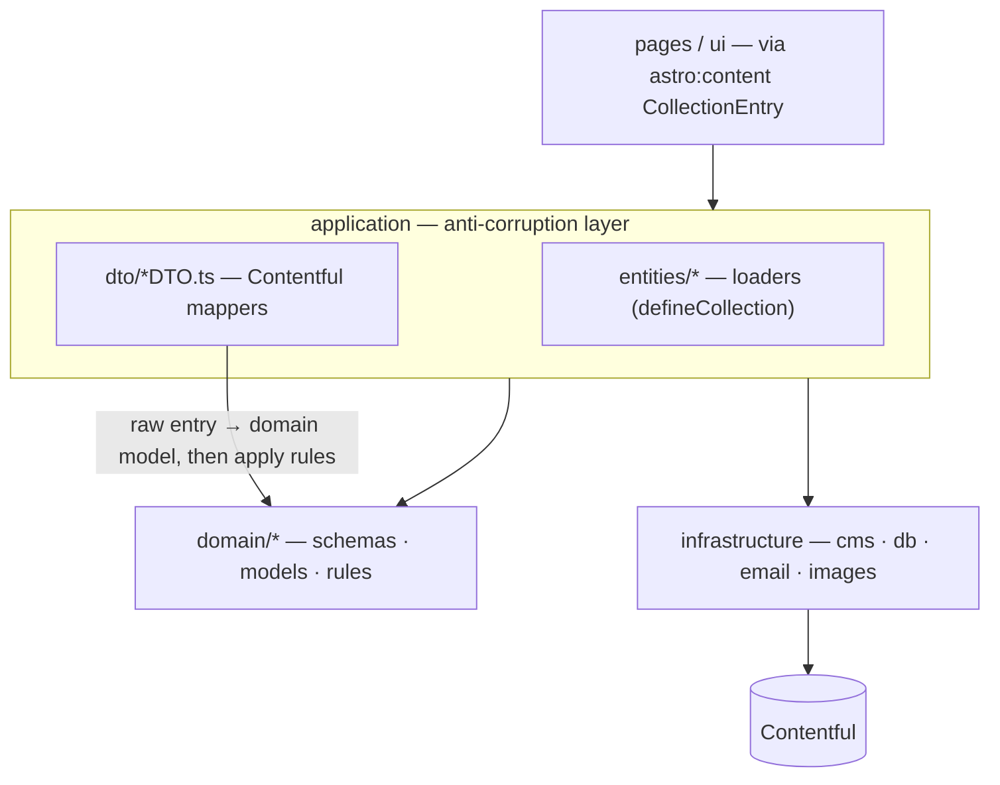

# Pragmatic DDD: a domain layer of models + rules behind a Contentful anti-corruption layer

`src/domain/` owns the domain **models** (Zod `schema.ts` + inferred `types.ts` + vocab enums such as `ArticleType`/`TagType`) and the pure **rules** (`rules.ts`: reading time, table of contents, description/variant derivation, favourite-first sort, city period, ...), one folder per concept (`article`, `author`, `city`, `project`, `tag`, `testimonial`, `contact`, `breadcrumb`, `shared`), each carrying only the files it needs (e.g. `breadcrumb` is rules-only, `contact` is a lone validation schema, and concepts whose rules stay in the ACL have no `rules.ts`). The Contentful mappers (`application/dto/*/*DTO.ts`) and Astro loaders (`application/entities/*`) stay as an **anti-corruption layer (ACL)** that turns raw Contentful entries into domain models and then calls domain rules.

It is deliberately pragmatic ("-ish"): there are no aggregates, repositories, or domain events, and schemas keep `astro/zod` + `reference()` because Astro drives app-wide typing via `CollectionEntry` (a full framework-free domain was considered and rejected as high-churn duplication for CMS-driven content).

The load-bearing invariant: **`domain/` never imports from `application/` or `infrastructure/`**. It may use `astro/zod`, `astro:content`'s `reference()`, other `@domain/*`, and generic `@shared/utils` helpers only. Rules that genuinely operate over raw Contentful entries and build cross-collection references (related-by-shared-tags, per-tag/author counts, articles-by-author) stay in the ACL on purpose — decoupling them would not preserve behaviour cheaply.

Dependencies point inward only: `ui → application → domain`, with `application → infrastructure → Contentful`. `domain` depends on nothing outward, so the domain model and its rules are testable and CMS-agnostic even though the schemas are Astro-typed.
