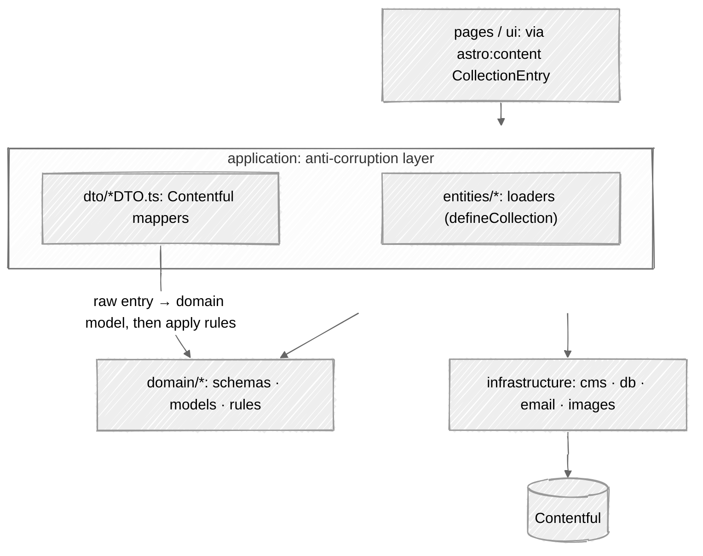

# Architecture

The site follows a **Domain-Driven Design(ish)** layering behind an anti-corruption layer over Contentful. The dependency direction is strict: `domain` knows nothing about anything else, and everything points inward toward it.

Every arrow is an import a layer may make; anything not drawn is forbidden.

---

## Layers

| Layer | Role | Side effect |
|---|---|---|
| **domain** | Zod schemas, inferred types, and pure editorial rules: reading time, table of contents, favourite-first sort, city period | None |
| **application** | The anti-corruption layer, in two halves: `dto/` maps raw Contentful entries to domain models, `entities/` loads them as Astro content collections | Content I/O, in the loaders only |
| **infrastructure** | The Effect clients: Contentful, Turso, email, image optimisation | Network, database, SMTP |
| **ui** | Astro components and React islands, grouped by feature area, with styles beside them | Rendering |
| **pages** | Routes, and the composition root | Whatever a route needs |

Each layer states its own rules in a colocated `CLAUDE.md`, and those guides are what the maintenance contract keeps honest.

---

## What the (ish) means

DDD is a set of practices, not one architecture. The failure mode the suffix names is real: **DDD asks for the abstraction before the code has earned it, and the boilerplate then hides the rules it was meant to protect.**

The split runs along the strategic/tactical line, and only one half is negotiable.

**The strategic half is taken whole.** One ubiquitous language, defined in [`CONTEXT.md`](https://github.com/fbuireu/biancafiore/blob/main/CONTEXT.md), where every domain word also lists the synonyms it displaces so a near-miss cannot drift in. A pure domain that performs no I/O, reads no env and holds no Effect. And the anti-corruption layer that keeps Contentful's `sys` and `fields` from reaching any of it, which is what keeps the CMS choice reversible.

**The tactical half is applied where it pays**, and the test is three questions asked in order: can the illegal state actually be reached, does anything read it, does it cross a boundary. Three "no" answers mean write the rule down instead of encoding it, because a divergence that is named is finished work.

What that rejected, concretely. There are **no aggregates**: an aggregate is a consistency boundary for writes, and nothing here writes content, since Contentful owns that and the only write path in the tree is a contact submission. There are **no repositories** as a domain abstraction, because a single read seam already exists and Astro's content collections are the read model. There are **no domain events**, because a publish is not an event this runtime observes: a Contentful webhook rebuilds the site instead. And the schemas are deliberately **not framework-free**, because Astro drives app-wide typing through `CollectionEntry` and a parallel model would be the same shapes written twice.

Value objects are decided per concept rather than by default, which is why there is no branded `Slug` type even though a Slug is persisted, addresses a page and reaches JSON-LD: it is minted in two modules and one module turns it into a path, so the minting boundary already gives the guarantee a brand would.

---

## Where the detail lives

| Question | Where |
|---|---|
| What does this domain word mean? | [`CONTEXT.md`](https://github.com/fbuireu/biancafiore/blob/main/CONTEXT.md), and **[Content Model](Content-Model)** |
| Why is the tree layered at all, and what did the (ish) drop? | [ADR 0012](https://github.com/fbuireu/biancafiore/blob/main/docs/adr/0012-pragmatic-ddd-domain-layer-anti-corruption-layer.md) |
| When does a concept earn a type of its own? | [ADR 0019](https://github.com/fbuireu/biancafiore/blob/main/docs/adr/0019-three-questions-before-modelling.md) |
| What does one layer actually guarantee? | the `CLAUDE.md` inside that layer's folder |
| What renders when, and where? | **[Rendering and Routing](Rendering-and-Routing)** |
| Why Effect for the infrastructure clients? | [ADR 0004](https://github.com/fbuireu/biancafiore/blob/main/docs/adr/0004-effect-for-infrastructure-clients.md) |

Neither half of the split is a matter of taste. The layer boundaries are asserted by a test that reads the imports rather than trusting the sentence above, and the vocabulary is what the glossary and the per-folder guides are for.
