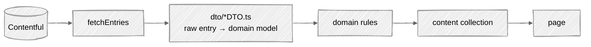

# Content Model

Editorial content is authored in Contentful and reaches the site as typed domain models. This page is the vocabulary and the path it travels; the normative glossary, with the synonyms each term displaces, is [`CONTEXT.md`](https://github.com/fbuireu/biancafiore/blob/main/CONTEXT.md).

---

## The vocabulary

| Term | What it is |
|---|---|
| **Article** | A single piece of long-form writing: title, body, author, publish date, topical Tags. The core unit of the Blog |
| **Blog** | The collection of all Articles, and the section that lists them. Never a single piece |
| **Project** | A typology of work rather than a single deliverable, shown in the portfolio. Titled "Disciplines" in reader-facing copy |
| **Testimonial** | A short attributed quote of praise, with role and photo, used as social proof |
| **Author** | The person credited with an Article. One Author is one Slug: the name is a display label, so two Authors sharing a name are still two Authors |
| **City** | A place the Author has lived, with a Period, coordinates, description and image, plotted on the About page |
| **Tag** | A topic label attached to Articles, identified by a name and a slug |
| **Author Tag** | An Author surfaced inside the Tag Index as if they were a Tag. One Slug addresses one page, so a collision with a topical Tag yields to the Tag |
| **Featured Article** | The reader-facing hero of the Blog |
| **Favorite** | The Author's own pick, which sorts to the top. Separate from Featured, and chosen for a different reason |

Concept names are binding. A folder, field or rule whose name disagrees with the glossary is a bug in one of the two.

---

## How an entry becomes a page

Four things are worth knowing about that path.

**Reading is complete by construction.** One module is the only way content is read, and it owns the page cursor: each query is walked page by page until every matching entry is in hand. Contentful's undeclared default is 100, so a query naming no limit would silently answer the first hundred, and under the Articles' reverse-chronological order what it drops is the oldest writing, with no error. A limit in a loader is therefore an editorial decision, never a guess at how much content exists.

**Contentful's types stop at the mapper.** `sys`, `fields` and `Entry<Skeleton>` may appear in the application layer and nowhere downstream. The domain never sees them.

**Bad data fails the build rather than degrading a page.** A malformed publish date, an unresolved author link or an Original Source the Republished flag would hide are refused where they are mapped. One entry taking the build down is the deliberate trade: the alternative is one page quietly rendering wrong.

**Identity is stated per concept.** Articles, Tags and Authors are keyed on their slug; Cities on their name, because a City's slug is derived from it and the two are one identity; Testimonials on the quoted person's name, because a Testimonial has no other identifier. That last one has a known cost: two quotes from one person would collapse. It is recorded rather than fixed with an id the CMS does not have.

---

## Republished writing

An Article can carry an `isRepublished` flag and an `originalSource`. They are two independent Contentful fields and only one of them the banner reads, so a source named without the flag would go nowhere and an editor would get no signal. One rule pairs them, which is why naming a source without ticking the flag is refused rather than ignored.

---

## Dynamic data

Contact submissions are the one thing this site writes. They go to **Turso** through **Drizzle ORM**, and the env vars are `ASTRO_DB_REMOTE_URL` and `ASTRO_DB_APP_TOKEN` despite the project having migrated off Astro DB. The names stayed on purpose: renaming them buys nothing and costs a coordinated change across the local env, the CI secrets and the deployed Worker. [ADR 0003](https://github.com/fbuireu/biancafiore/blob/main/docs/adr/0003-drizzle-libsql-turso-over-astro-db.md) records it.

---

## Adding a content type

Four steps, in this order, and the glossary entry belongs in the same change:

1. a domain concept: `schema.ts`, `types.ts`, and `rules.ts` if there is a rule to put in it
2. a DTO that maps the raw Contentful entry onto it
3. an entity loader that fetches, maps and returns entries with an id
4. registration as a content collection

The application layer's own guide has the procedure in full, and the docs test asserts each step against the code.
