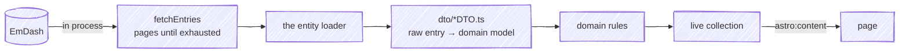

# Content Model

Editorial content is authored in EmDash, a CMS that runs inside the site's own Cloudflare Worker, and reaches a page as typed domain models on the request that renders it, the Workers cache answering every request after that until a publish purges it. This page is the vocabulary and the path it travels; the normative glossary, with the synonyms each term displaces, is [`GLOSSARY.md`](https://github.com/fbuireu/biancafiore/blob/main/GLOSSARY.md).

---

## The vocabulary

| Term | What it is |
|---|---|
| **Article** | A single piece of long-form writing: title, body, author, publish date, topical Tags. The core unit of the Blog |
| **Blog** | The collection of all Articles, and the section that lists them. Never a single piece |
| **Project** | A typology of work rather than a single deliverable, shown in the portfolio. Counted as "Disciplines" in reader-facing copy |
| **Testimonial** | A short quote of praise attributed to a Quotee, with their role and photo, used as social proof |
| **Quotee** | The named person a Testimonial quotes. Never an Author: an Author writes Articles |
| **Author** | The person credited with an Article, an EmDash byline in the CMS. One Author is one Slug: the name is a display label, so two Authors sharing a name are still two Authors |
| **City** | A place the Author has lived, with a Period, coordinates, description and image, plotted on the About page |
| **Tag** | A topic label attached to Articles, identified by a name and a slug |
| **Author Tag** | An Author surfaced inside the Tag Index as if they were a Tag. One Slug addresses one page, so a collision with a topical Tag yields to the Tag |
| **Featured Article** | The Article the Blog leads with, chosen for the reader |
| **Favorite** | The Author's own pick, which sorts to the top. Separate from Featured, and chosen for a different reason |

Code is named after these terms; [`CODING_STANDARDS.md`](https://github.com/fbuireu/biancafiore/blob/main/CODING_STANDARDS.md) holds a review to it.

---

## How an entry becomes a page

```mermaid
---
config:
  look: handDrawn
  layout: dagre
---
flowchart LR
    cms[("EmDash")] -- "in process" --> fetch["fetchEntries<br/>pages until exhausted"]
    fetch --> loader["the entity loader"]
    loader --> dto["dto/*DTO.ts<br/>raw entry → domain model"]
    dto --> rules["domain rules"]
    rules --> collection["live collection"]
    collection -- "astro:content" --> page["page"]
```

**These arrows are the path one entry travels on a request, not imports.** The import graph is a different picture and is on **[Architecture](Architecture)**; reading this one as dependencies would get the direction of half of them wrong.

Some things are worth knowing about that path.

**Reading is complete by construction.** One module is the only way content is read, and it owns the page cursor: each query is walked page by page until every matching entry is in hand. EmDash's default page is 50, so a query naming no limit would silently answer the first fifty, and under the Articles' reverse-chronological order what it drops is the oldest writing, with no error. A limit in a loader is therefore an editorial decision, never a guess at how much content exists.

**The CMS's types stop at the mapper.** An entry's `data`, its `references` and Portable Text may appear in the application layer and nowhere downstream. The domain never sees them, which is why moving from Contentful to EmDash changed the mappers and nothing the pages render.

**Bad data fails the build rather than degrading a page.** A malformed publish date, an Article no byline credits or an Original Source the Republished flag would hide are refused where they are mapped. One entry taking the build down is the deliberate trade: the alternative is one page quietly rendering wrong.

**Identity is stated per concept.** Articles, Tags and Authors are keyed on their slug; Cities on their name, because a City's slug is derived from it and the two are one identity; Projects on the id their mapper derives; Testimonials on the Quotee's name, because a Testimonial has no other identifier. That last one has a known cost: two quotes from one person would collapse. It is recorded rather than fixed with an id the CMS does not have.

---

## Republished writing

An Article can carry an `isRepublished` flag and an `originalSource`. They are two independent CMS fields and only one of them the banner reads, so a source named without the flag would go nowhere and an editor would get no signal. One rule pairs them, which is why naming a source without ticking the flag is refused rather than ignored.

---

## What an editor sets beyond the content

Three things a reader sees come from EmDash but are not entries:

- **The site settings** (*Settings → General* and *Settings → SEO*): the site's name and description, its social links, the separator between a page's title and the site's, the default share image, and the Google and Bing verification tokens.
- **The menus** `header` and `footer` (*Menus*): the links the header's menu and the footer's legal line show. A label can bracket the words that link, `know more [About] me`, and the words around them stay prose.
- **An Article's SEO panel**: a title, a description and a share image that replace the ones the page derives, and a switch that keeps the page out of search engines.

The seed writes today's settings and menus into a new database, and each value falls back to today's when it is empty, so a database seeded before they existed still renders the site as it was. A link an editor typed is only kept when it is a path on this site or an `http`, `https`, `mailto` or `tel` URL, and a social link only when it is a full `https://` URL. Saving any of them purges the cached pages, like a publish does.

---

## Dynamic data

Contact submissions are the one thing this site writes. They go to **Turso** through **Drizzle ORM**, and the env vars are `ASTRO_DB_REMOTE_URL` and `ASTRO_DB_APP_TOKEN` despite the project having migrated off Astro DB. The names stayed on purpose: renaming them buys nothing and costs a coordinated change across the local env, the CI secrets and the deployed Worker. [ADR 0003](https://github.com/fbuireu/biancafiore/blob/main/docs/adr/0003-drizzle-libsql-turso-over-astro-db.md) records it.

---

## Adding a content type

These steps, in this order, and the glossary entry belongs in the same change:

1. a domain concept: `schema.ts`, `types.ts`, and `rules.ts` if there is a rule to put in it
2. a collection in the CMS, declared in its seed and added in each environment's admin
3. a DTO that maps the raw CMS entry onto it
4. an entity loader that fetches, maps and returns entries with an id
5. registration as a live collection, with its cache tag among the ones a publish purges

The application layer's own guide has the procedure in full, and the docs test asserts each step against the code.
